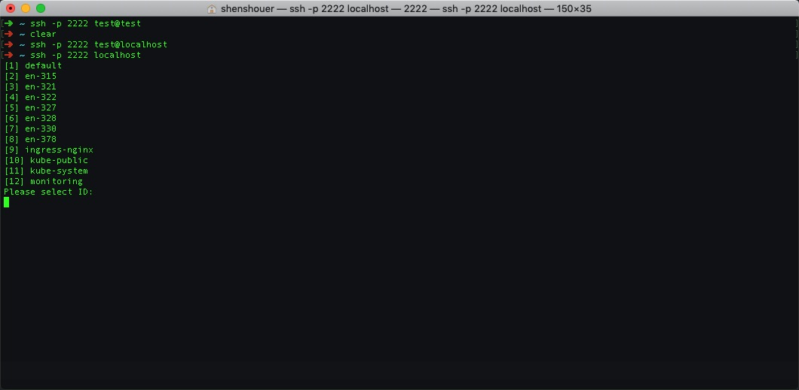
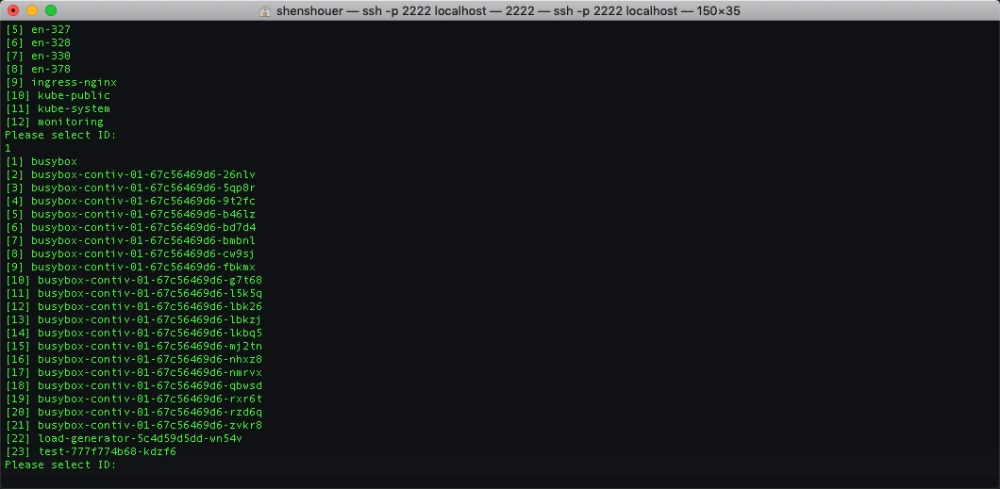
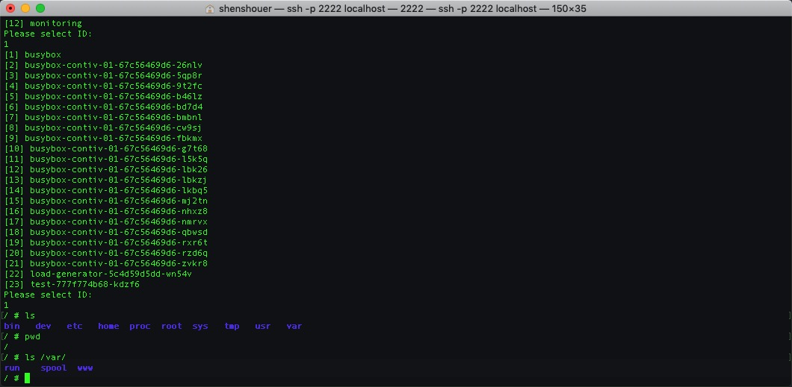

# k8s-ssh-pod

example for ssh to kubernetes containers. 

There is some bug for exit container shell, and ssh server print error log like:

```
...
ERROR: logging before flag.Parse: E1123 16:23:11.567893   98023 v3.go:79] EOF
ERROR: logging before flag.Parse: E1123 16:23:11.569049   98023 v3.go:79] EOF
ERROR: logging before flag.Parse: E1123 16:23:11.570347   98023 v3.go:79] EOF
```


## build

```
GO111MODULE=on go build -mod=vendor

```

## run server

```
./k8s-ssh-pod
2018-11-23T16:10:51.875 Infof ▶ INFO 001 Current Version: master
2018-11-23T16:10:51.875 Infof ▶ INFO 002 Start SSH Server at :2222
```

## ssh client

open new terimal

```
ssh -p 2222 localhost
```
select namespace


select pod (default select the first container in pod to exec in)


shell in container
